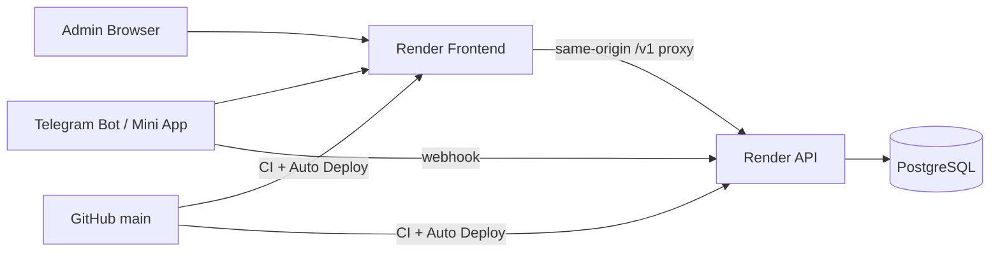

# TG 会员系统：Lovable 开发交接

## 1. 交接基线

- GitHub 是唯一 Source of Truth。基线提交：`06bdc9a4cd37ae153e2b0b3800573fce1d91c2d1`。
- Staging 已完成：P1、P2、P2.1、P3、P4、P5-A、P5-B、Member/Growth Batch A、Login Stability，状态均为 PASS。
- 数据库 migration 集合严格为 `001`–`013`。
- Staging 的 Level V1、Growth V1、FUN66 Platform V1 已发布；Member/Growth 已启用并验收。
- Batch B、Benefits、真实游戏机会、正式新版 Content Publishing Backend 尚未开始。

Lovable 必须从现有仓库继续，建议分支 `lovable/member-product-ui-v2`。不要新建第二套项目，不要直接重写 `main`，不要复制一套 API client、i18n 或 design system。

## 2. 项目是什么

这是 Telegram 会员运营平台，连接 Telegram Bot、Mini App、Admin、平台日报、会员与 Growth、Points、D→D+1 资格、邀请和兑换。未来范围包括 Benefits、Activities、Games、Content Publishing 和 Analytics。

用户只需要理解四个核心概念：

- **Level**：会员身份。
- **Growth**：升级进度，和 Points 分账。
- **Points**：奖励、消费和兑换资产。
- **Benefits**：等级对应权益；当前后端尚未实现。

## 3. 真实架构



- **Frontend**：Vite/React，Admin 入口 `web/src/App.tsx`，Mini 入口 `web/src/mini/main.tsx`。
- **Frontend proxy**：`web/server/staging-server.mjs`。保留请求关联、安全错误分类和严格 TLS；POST 不自动重试。
- **API**：Fastify，组装入口 `src/app.ts`，运行入口 `src/server.ts`。
- **PostgreSQL**：业务事实、账务、规则、Audit；schema 在 `db/migrations/001_*.sql` 至 `013_*.sql`。
- **Telegram**：Webhook 进入 `src/telegram.ts`；Mini initData 验证、exchange、recovery 在 `src/mini-auth.ts` 等文件。
- **Staging**：API 和 Frontend 均为非休眠 Render 实例。不要在文档、代码或 UI 中放连接串、Token 或其他 Secret。

## 4. 当前导航与产品状态

### Mini App

当前主导航在 `web/src/mini/main.tsx`：

1. 首页
2. 会员
3. 活动
4. 奖励
5. 邀请
6. 我的

产品目标把普通游戏入口纳入“游戏”体验；当前真实游戏机会后端未实现，不能展示可用次数或结果。现有 Activities 返回未发布状态，页面是安全占位。

### Admin

当前 `web/src/App.tsx` 的主导航：

1. 总览
2. 用户
3. 会员
4. 活动
5. 积分
6. 游戏
7. 数据
8. 设置

“内容”是下一阶段需要加入的产品入口，目前没有正式新版发布中心和后端。

## 5. 已经工作的能力

- Admin Cookie Session：登录、恢复、退出、CSRF、Origin、RBAC。
- Mini：Telegram initData exchange、Bearer session、Recovery Cookie、Reload、关闭重开、Logout。
- P3：平台与 UID 绑定，pending/verified/rejected/conflict/revoked，管理员审核及脱敏列表。
- P4：Adapter、Mapping、Preflight、Activate、Canonical Daily Fact、Revision、证据链。
- P5-A：Point Account、Ledger、Lot、Allocation、Expiry、Refund、三账对账。
- P5-B：D→D+1 Qualification、Entitlement、Revision、Task、SLA、Conflict→Review Required。
- Batch A：Member、Growth Account/Ledger、Growth 来源、日重算、Daily Cap、Correction、Level Rules/History、签到。
- Dashboard：Bot 范围基本指标；Brand 范围 Member/Growth 指标。
- i18n：Mini 的 `zh-CN`、`en`、`pt-BR`、`es-MX`、`fil`。

## 6. UI 框架与未完成能力

| 能力 | 当前状态 |
|---|---|
| Admin 活动/游戏空间 | UI 框架/安全占位，不代表业务已上线 |
| Mini 活动 | catalogue 未发布，participation disabled |
| Benefits | `BACKEND_PENDING` |
| Game Opportunities / 游戏结果 | `BACKEND_PENDING` |
| Content Publishing、Media、Scheduler、Worker | `BACKEND_PENDING` |
| Dashboard 活跃、绑定期末快照、活动、游戏、待办等指标 | 待接入；UI 必须显示“待接入”，不能假 0 |
| Content Publishing UI | 下一阶段重点，可先做 typed contract 和 UI |

## 7. Where to Change What

| 目标 | 真实位置 |
|---|---|
| Mini 页面与路由状态 | `web/src/mini/main.tsx` |
| Mini API client/types | `web/src/mini/client.ts` |
| Mini i18n | `web/src/mini/i18n.ts` |
| Mini 会员卡 | `web/src/mini/MemberCard.tsx` |
| Mini 平台账号 | `web/src/mini/PlatformAccounts.tsx` |
| Mini 样式 | `web/src/mini/style.css` |
| Admin shell/navigation/login | `web/src/App.tsx` |
| Admin Member/Growth | `web/src/product/MemberAdmin.tsx` |
| Admin Dashboard/Data Center | `web/src/product/Dashboard.tsx`, `web/src/product/MemberMetrics.tsx`, `web/src/product/metrics.ts` |
| Admin 平台、日报、资格、积分有效期 | `web/src/platforms`, `web/src/platform-data`, `web/src/entitlements`, `web/src/point-expiry` |
| Admin API client/error UX | `web/src/api.ts` |
| Admin 产品文案/i18n | `web/src/product/copy.ts`, `web/src/product/i18n.ts` |
| Admin 全局样式 | `web/src/style.css` |
| Admin Auth/API 组装 | `src/browser-auth.ts`, `src/app.ts` |
| Mini Auth/API | `src/mini-auth.ts`, `src/mini-sessions.ts`, `src/mini-recovery.ts`, `src/mini-queries.ts` |
| Member/Growth 核心 | `src/member-growth.ts`, `src/member-domain.ts`, `src/member-routes.ts` |
| Points 核心 | `src/points.ts`, `src/point-lots.ts`, `src/point-expiry-routes.ts` |
| P4/P5-B 核心 | `src/platform-*.ts`, `src/entitlement-*.ts`, `src/entitlements.ts` |
| Proxy | `web/server/staging-server.mjs` |
| Database | `db/migrations`, `db/runtime-grants.sql` |
| Backend tests | `tests/*.test.ts` |
| Frontend tests | `web/tests`, `web/e2e` |

## 8. 开发分工和变更规则

Lovable 主要负责 Frontend/UI/UX：页面结构、组件、响应式、loading/empty/error、typed API contract、可访问性和产品文案。

Codex/Claude 负责 Database、Migration、Core Backend、Ledger、并发、幂等、Telegram Publishing Backend、Scheduler、Benefits Core、Game Opportunity Core 和安全验收。

如果 UI 需要修改 Protected Core，不要自行实现。输出：

```text
BACKEND_CHANGE_REQUIRED
Need: <所需能力>
Why: <用户场景和阻塞>
Current API gap: <当前接口不足>
Expected request: <期望输入>
Expected response: <期望输出与错误状态>
```

两边不得同时修改同一核心文件。所有工作经 feature branch、review、CI 后再合并。

## 9. 开始开发前的最小检查

1. `git fetch`，从最新 `origin/main` 创建 `lovable/member-product-ui-v2`。
2. 阅读本目录四份交接文档。
3. 运行 Frontend component tests、browser tests 和 build；不要为了 UI 改动重写后台。
4. 新页面先使用现有 `request()` 和 i18n；不存在的 API 标记 `BACKEND_PENDING`。
5. 不显示技术 JSON、fingerprint、Fact Revision、Lot Allocation；只放在高级诊断。

